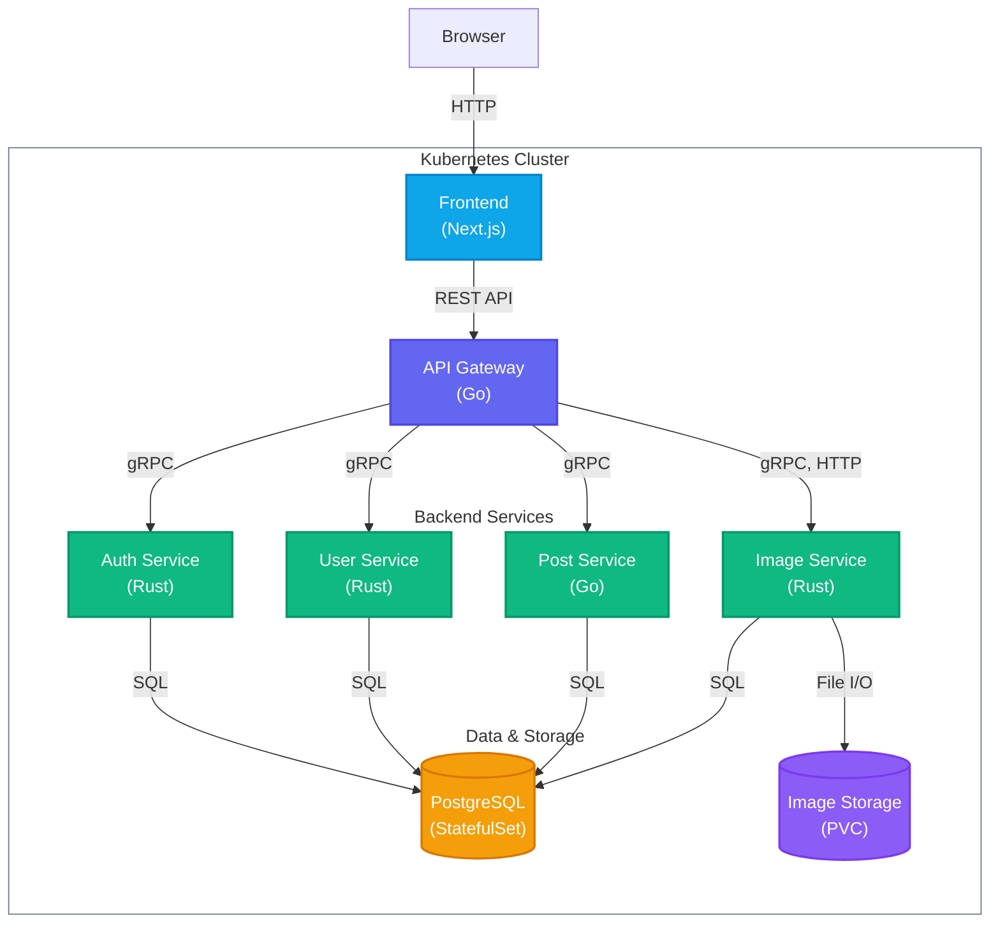

# Thoughts

**Thoughts** is a full-stack post-sharing platform built with a production-grade microservices architecture. Combining high-performance Go and Rust gRPC backends with a modern Next.js frontend, it provides a seamless experience for users to create, browse, and interact with posts.

## Features

- **Microservices Architecture**: Backend composed of modular services written in Go and Rust, using gRPC for high-performance internal communication.
- **Production-Ready & HA**: Fully containerized, stateless services designed for High Availability deployments on Kubernetes.
- **API Gateway**: Centralized Go-based HTTP gateway routing requests to the underlying internal microservices.
- **Resilience**: Built-in rate limiting in the gateway to protect against abuse and traffic spikes.
- **Observability**: Structured logging and tracing implemented across backend services for debugging and monitoring.
- **Modern Frontend**: Built with Next.js (App Router), React, Tailwind CSS, and DaisyUI.

## Architecture



| Service | Language | Description |
| --- | --- | --- |
| [apigateway](/apps/apigateway) | Go | API Gateway routing HTTP traffic to internal gRPC backends. |
| [authservice](/apps/authservice) | Rust | User authentication and session management. |
| [database](/apps/database) | PostgreSQL | Database schema, tables, and functions. |
| [frontend](/apps/frontend) | TypeScript | Next.js/React web application. |
| [imageservice](/apps/imageservice) | Rust | Image upload, verification, and staging cleanup. |
| [postservice](/apps/postservice) | Go | Core logic for creating, liking, and reposting posts. |
| [userservice](/apps/userservice) | Rust | User profile and follower graph management. |

## Deploy

Deploy the application to your active Kubernetes cluster using the provided script:

```sh
./scripts/deploy.sh
```

The script builds the Docker images, creates the Kubernetes namespace (`thoughts` by default) and resources, waits for pods to be ready, and starts a port-forward to the frontend at http://localhost:8080/. It is idempotent and safe to re-run for updates.

## Cleanup

To remove all deployed resources and the namespace:

```sh
kubectl delete -f ./deploy -n thoughts
kubectl delete namespace thoughts
```

## Testing

Run all unit tests across the frontend and backend microservices using the provided `Makefile` target:

```sh
make test
```

## License

Licensed under the [MIT](LICENSE) License.
