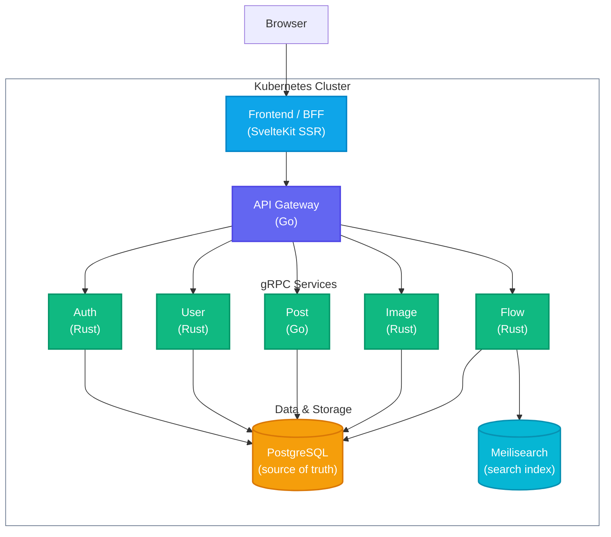

# Cogito

**Cogito** is a full-stack post-sharing platform built with a production-grade microservices architecture. Combining high-performance Go and Rust gRPC backends with a SvelteKit frontend, it provides a seamless experience for users to create, browse, and interact with posts.

## Features

- **Post interactions**: Create plain posts, replies, quotes, and reposts. Like, unlike, repost, and remove reposts.
- **Hashtags**: Extracted from post content at write time, stored relationally, and searchable with trigram typeahead.
- **Global search**: Full-text search across users, posts, and hashtags via Meilisearch, kept current by a transactional outbox.
- **Activity notifications**: Like, repost, reply, and follow events generate per-user notifications. Persisted, keyset-paginated, and individually marked read.
- **Materialized home feed**: Activity events fan out to a per-user feed table via Redpanda. High-follower accounts skip fan-out and merge on read instead.
- **Image uploads**: Magic-byte validated, server-named, staged in SeaweedFS with a verify-then-consume lifecycle.
- **Cache layer**: Dragonfly (Redis-protocol) backs rate-limit token buckets and login-failure counters, keeping the hot path off PostgreSQL.
- **Session management**: Argon2id password hashing, HMAC-keyed session tokens, per-user session listing and remote revocation.
- **Production-ready**: Stateless services, bounded concurrency, explicit gRPC timeouts, circuit breaker and retry on the image proxy, structured JSON logging.
- **HA-ready**: Ships at `replicas: 1` but correct at `replicas: N`. No shared in-process state; consumers use idempotent inserts and committed offsets.

## Architecture



| Service | Language | Description |
| --- | --- | --- |
| [frontend](/apps/frontend) | TypeScript | SvelteKit SSR application; sole public entry point and BFF. |
| [apigateway](/apps/apigateway) | Go | Public HTTP API, auth boundary, gRPC orchestrator, image proxy. |
| [authservice](/apps/authservice) | Rust | Session lifecycle — issue, validate, revoke, background expiry cleanup. |
| [userservice](/apps/userservice) | Rust | User accounts, credentials, and follow graph. |
| [postservice](/apps/postservice) | Go | Posts, replies, quotes, reposts, likes, hashtags, and feed. |
| [imageservice](/apps/imageservice) | Rust | Image upload staging, verification, and serving via SeaweedFS. |
| [flowservice](/apps/flowservice) | Rust | Notifications and feed fan-out; full-text search (Meilisearch). |
| [database](/apps/database) | PostgreSQL | Versioned schema migrations managed by `migrate/migrate`. |

### Infrastructure

Five in-cluster services run alongside the application:

- **PostgreSQL** — Primary source of truth for all application data.
- **Dragonfly** — Redis-protocol cache backing rate-limit token buckets and login-failure counters. The API fails open on unavailability.
- **SeaweedFS** — S3-compatible object store holding image bytes. Images are staged under `staging/` on upload and promoted on post creation.
- **Meilisearch** — Derived search index. PostgreSQL is the only source of truth; Meilisearch is populated and kept current by Redpanda Connect pipelines. The index can be rebuilt by replaying the outbox.
- **Redpanda** — Kafka-compatible event broker. Redpanda Connect relays PostgreSQL CDC (`outbox` table) to `entity-changes` and `activity` topics consumed by `flowservice`.

## Docs

Architectural specs live in [`docs/`](/docs/):

| Doc | Contents |
| --- | --- |
| [architecture.md](/docs/architecture.md) | Service topology, request flow, integration patterns |
| [api.md](/docs/api.md) | HTTP endpoints, middleware stack, gRPC services, pagination |
| [data-model.md](/docs/data-model.md) | Schema, indexes, entity relationships, domain invariants |
| [security.md](/docs/security.md) | Session model, password policy, ownership rules, rate limiting |
| [business-rules.md](/docs/business-rules.md) | Validation constraints, post types, ordering, content policy |
| [frontend.md](/docs/frontend.md) | Route map, layout hierarchy, SSR, data fetching |
| [design-system.md](/docs/design-system.md) | Theme, component inventory, layout |
| [infrastructure.md](/docs/infrastructure.md) | Kubernetes resources, secrets, probes, storage |

## Deploy

Deploy the application to your active Kubernetes cluster using the provided script:

```sh
./scripts/deploy.sh
```

The script builds the Docker images, creates the Kubernetes namespace (`cogito` by default) and resources, waits for pods to be ready, and starts a port-forward to the frontend at http://localhost:8080/. It is idempotent and safe to re-run for updates.

## Cleanup

To remove all deployed resources and the namespace:

```sh
kubectl delete -f ./deploy -n cogito
kubectl delete namespace cogito
```

## Testing

Run all unit tests across the frontend and backend microservices:

```sh
make test
```

## License

Licensed under the [MIT](LICENSE) License.
